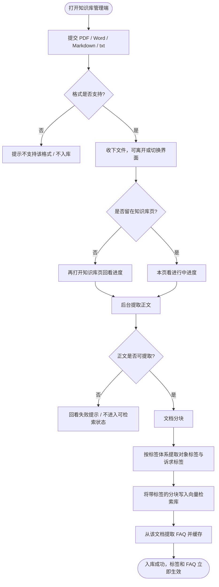
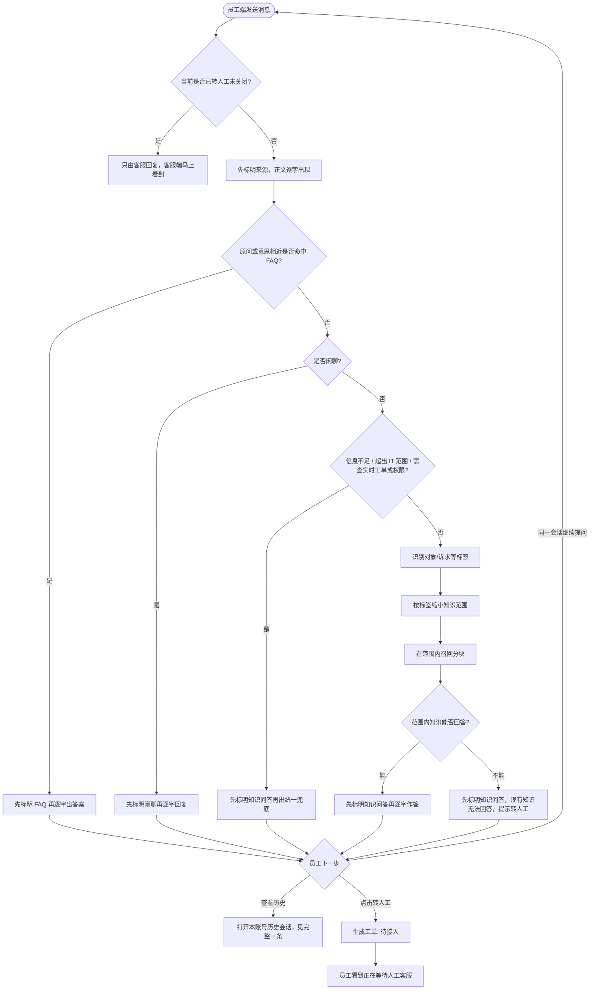
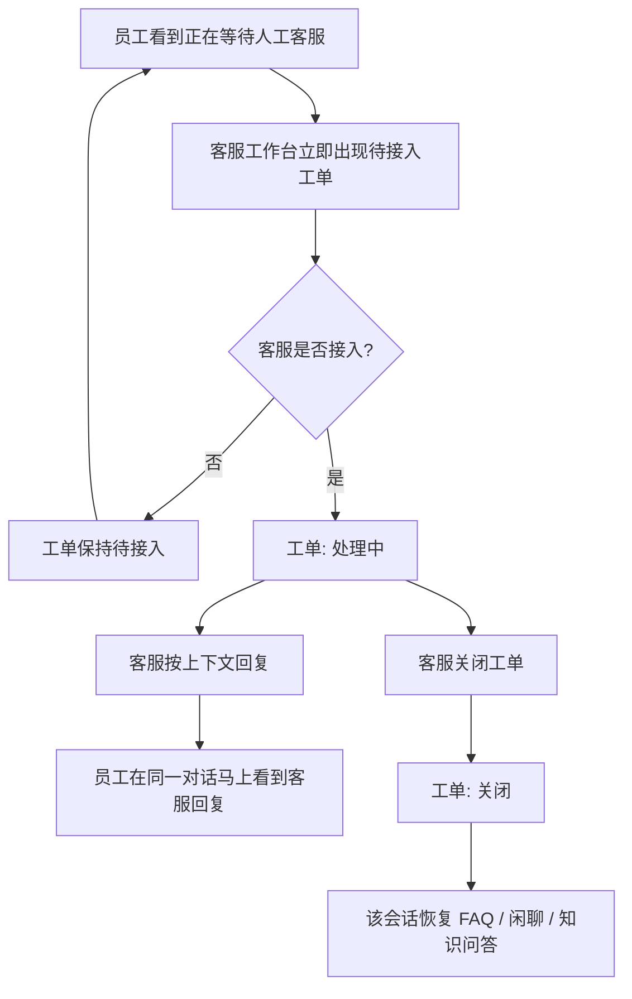
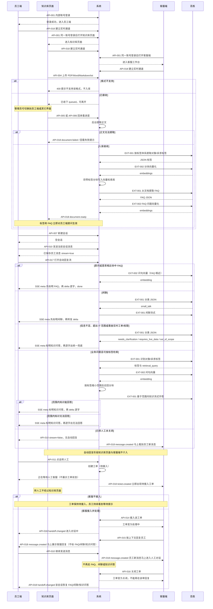

# 智能客服系统
status: Confirmed

## 用户目标与完整流程

内部员工遇到企业 IT 问题时，在网页登录后提问。当前没有智能问答，由人工客服主动回答。本次知识由管理员在知识库管理端入库，抽出的标签和 FAQ 入库成功后立即对提问生效。员工提问先走 FAQ 拦截（原问和意思相近的问都拦）；未命中再判断是否闲聊，闲聊直接回复；业务问题先识别标签，只在匹配标签的知识范围内召回分块，再由 AI 作答。信息不足、超出企业 IT 知识范围、以及需要查询实时工单/申请/权限等工具才能回答的情况，不追问、不查实时数据，统一按超范围给出同一条兜底回复。范围内知识仍无法回答时，说明「现有知识无法回答」并提示可转人工。转接只在员工点击后发生。员工看到的系统回复标明来自 FAQ、闲聊或知识问答。

标签体系见 `docs/tag-taxonomy.json`。对象标签与诉求标签同时用于知识入库标注和提问识别；只用当前会话上下文，不做长期用户画像，也不用跨会话记忆。

一条完整例子：用内部账号登录 → 在知识库管理端上传一份「VPN 认证失败」文档（提交后可去别的页面）→ 回来看到入库成功 → 分块、标签和 FAQ 立即生效 → 员工问意思相近的「连不上公司 VPN，提示认证失败」→ 先标明「FAQ」再逐字出答案。问「今天天气真好」→ 先标明「闲聊」再逐字回复。问明确的硬件故障且 FAQ 未命中 → 按标签缩小范围后知识问答，先标明「知识问答」。问「我那张报修单现在办到哪了」→ 超范围兜底（标明「知识问答」）。需要人工时员工点「转人工」→ 生成待接入工单，客服接入后只由客服回复，客服一发员工马上看到。

## 本次范围

- 本次交付：内部账号密码登录；同一账号进入员工端 / 客服工作台 / 知识库管理端；知识入库（PDF、Word、Markdown、txt），含分块、标签提取、写入检索库、FAQ 提取；提交后可离开并回看进度，入库成功立即生效；提问侧 FAQ 相近拦截、闲聊直接回复、按标签缩小范围后的知识问答；回复先标明来源（FAQ / 闲聊 / 知识问答）再逐字出现；信息不足、超范围、实时工单一律超范围兜底；多轮对话（仅当前会话）；历史会话；员工点击转人工即建工单；客服自行接入并回复，员工马上看到客服消息；工单状态（待接入、处理中、关闭）。
- 非目标：多用户账号体系与角色权限；外部客户客服；AI 自动转人工；为补全信息而追问；查询实时工单/申请/权限或调用此类工具；员工检索或浏览知识库；员工查看或操作工单状态；长期用户画像与跨会话记忆；评价、通知、移动端 APP。
- 约束：Web；转人工仅员工点击触发；转人工后仅客服回复；知识检索必须先按标签缩小范围，禁止对全库所有分块做无标签过滤的召回；入库后的分块进入向量检索库（实现细节留技术方案）。

## 需求与验收

### REQ-001 内部账号登录并进入三端
- 用户结果与主流程：使用预设内部账号（用户名+密码）登录后，可进入员工端、客服工作台、知识库管理端。本次不区分多用户与角色权限。
- 业务规则、权限、数据归属与状态：未登录不能使用三端。同一账号具备三端入口。不提供账号注册、角色分配或多账号隔离。
- 业务前置条件：系统已配置可用的内部账号。
- AC-001：使用正确的内部账号密码 → 登录成功 → 能进入员工端、客服工作台和知识库管理端；验证方式：同一账号分别打开三个入口。
- AC-002：密码错误或未登录 → 不能进入任一端，并看到需登录或账号无效的明确提示；验证方式：错误密码登录、未登录直接访问。

### REQ-002 提问处理：FAQ 拦截、闲聊与标签范围内的知识问答
- 用户结果与主流程：员工在员工端发送消息后，系统按固定顺序处理：先 FAQ 拦截（缓存原问及意思相近的提问都拦截）；未命中再识别是闲聊还是业务问题；闲聊直接回复；业务问题若属于信息不足、超出企业 IT 知识范围、或需要实时工单/申请/权限等工具数据，不追问、不查实时状态，统一返回超范围兜底：「当前问题超出知识服务范围，你可以点击转人工。」其余业务问题先判断对象/诉求等标签，只在匹配标签的知识分块中召回，再生成回答。自动回复先标明来源，正文逐字出现；中途离开后再打开该会话，看到的是完整一条。多轮只使用当前会话已提供的信息。范围内知识无法回答时，明确说明「现有知识无法回答」，并提示可点击「转人工」；不自动转接。系统自动回复均标明来源：FAQ、闲聊或知识问答。超范围兜底与「现有知识无法回答」均标为知识问答。客服人工回复不要求这三种来源标记。
- 业务规则、权限、数据归属与状态：
  - 不编造未入库内容。
  - 不是所有提问都对全库分块召回。
  - `needs_clarification`、`requires_live_data`、`out_of_scope` 对用户均为同一超范围兜底，不单独追问、不接实时查询工具。
  - 分类不完全确定但已能有意义检索时先检索，不为分类本身反复追问。
  - 转人工成功后本会话不再走 FAQ/闲聊/AI（见 REQ-004）。
  - 标签体系、分类规则与提问识别字段以 `docs/tag-taxonomy.json` 为准。
- 业务前置条件：已登录；FAQ 或知识已入库（对应场景）或确认未入库（无法回答场景）。
- AC-003：知识库中有对应内容且未被 FAQ 拦截 → 员工提出业务问题并在同一会话追问 → 先标明「知识问答」再逐字出现基于标签范围内知识的回复，追问承接当前会话上文；验证方式：先入库再提问、追问。
- AC-004：属于企业 IT 且可检索、但范围内无对应知识 → 员工提问且 FAQ 未命中 → 先标明「知识问答」再看到「现有知识无法回答」并提示可点「转人工」，不产生工单；验证方式：对未入库的 IT 主题提问。
- AC-016：已抽出并缓存的 FAQ → 员工用原问或意思相近的问法提问 → 先标明「FAQ」再逐字出现该 FAQ 答案，不进入标签召回后的知识问答；验证方式：入库后分别用原问和改写问提问，均得到该 FAQ 答案。
- AC-017：员工发送闲聊 → 先标明「闲聊」再逐字出现闲聊回复，不按知识库作答、不走超范围兜底、不建工单；验证方式：发送与 IT 知识无关的寒暄。
- AC-018：硬件类知识与软件类知识均已入库 → 员工提出明确的硬件故障问题 → 先标明「知识问答」，回答只依据硬件相关范围内的知识；验证方式：两类文档入库后用硬件问题提问并核对应答依据范围。
- AC-023：员工提出信息不足、超出 IT 范围、或查询某张工单/申请当前进度的问题 → 均先标明「知识问答」再看到同一条超范围兜底文案，不出现针对性追问，也不查出真实工单状态；验证方式：三类各测一条，文案一致。

### REQ-003 知识入库：分块、打标、检索存储与 FAQ 提取
- 用户结果与主流程：在知识库管理端提交 PDF、Word、Markdown 或 txt 后，系统先收下文件，管理员可以离开或切换界面；后台完成：校验已通过的格式 → 文档分块 → 按标签体系提取对象标签与诉求标签 → 将带标签的分块写入向量检索库 → 从该文档提取 FAQ 并缓存。再打开知识库页能看到进行中、成功或失败。入库成功后标签和 FAQ 立即对提问生效，无需管理员再确认。
- 业务规则、权限、数据归属与状态：入库只在知识库管理端进行；员工端没有知识检索或上传入口。对象标签取自 hardware / software / account / network / resource；诉求标签取自 troubleshooting / maintenance / resource_request / permission_request / usage_guidance / policy_process。实体记录文档中的具体名称，不作为预先穷举的标签。不支持的格式不能入库。入库未完成前，该文档不能用于 FAQ 拦截或知识召回。
- 业务前置条件：已登录；文档为支持的格式之一。
- AC-005：在知识库管理端提交支持格式的文档后可离开或切换界面 → 再打开知识库页看到该文档入库成功 → 立刻到员工端就该内容提问 → 能通过 FAQ（含相近问）或标签范围内召回得到与原文要点相符的回复；验证方式：四种格式各入库一份，提交后离开再回来，成功后立即提问。
- AC-006：在员工端操作 → 不能上传或检索知识库；验证方式：员工端无入库/检索入口，无法写入知识。
- AC-007：在知识库管理端提交不支持的格式 → 当场不能入库，并看到不支持该格式的明确提示；该文件不分块、不打标、不进入检索库、不产生 FAQ；验证方式：提交非 PDF/Word/Markdown/txt 文件。
- AC-019：文档入库过程中或回来之后 → 知识库管理端能看到进行中进度；成功后能确认该文档已完成分块、已带对象/诉求标签、已写入检索库、已抽出 FAQ；验证方式：提交后查看进度，成功后再看分块/标签/FAQ 是否存在。
- AC-020：入库过程失败（如无法提取正文）→ 该文档不进入可检索状态；即使已离开，再打开知识库页也能看到明确失败提示；验证方式：提交无法提取正文的文件（如空文档或损坏文件），离开后再回来查看。
- AC-024：入库成功后不经任何确认步骤 → 员工端立即能被该文档的 FAQ 相近拦截或标签召回（离开期间成功的同样立即生效）；验证方式：入库成功后马上提问，无需再点确认。

### REQ-004 转人工后仅客服回复
- 用户结果与主流程：员工点击「转人工」后生成工单并进入等待；客服在工作台接入后，看到此前对话并主动回复，员工在同一对话中马上看到客服消息（不必刷新页面）。接入后 FAQ/闲聊/AI 均停止作答。
- 业务规则、权限、数据归属与状态：转人工仅员工点击触发。无人接入时员工只看到「正在等待人工客服」，看不到工单状态。同一会话在待接入或处理中时不能再生成第二张工单。客服关闭工单后，该次转人工结束，员工端该会话恢复为由 FAQ/闲聊/AI 处理；再次转人工则生成新工单。
- 业务前置条件：已登录且处于员工端会话。
- AC-008：会话为系统自动回复中 → 员工点击「转人工」→ 员工看到「正在等待人工客服」，客服工作台立即出现对应待接入工单及对话上下文（无需手动刷新）；验证方式：点转人工后两端对照。
- AC-009：员工未点击「转人工」→ 保持自动回复链路，客服工作台不出现新工单；验证方式：仅与系统多轮对话。
- AC-010：工单为处理中 → 员工继续发送消息 → 只进入人工对话，不出现 FAQ/闲聊/AI 新回复；客服发出的消息立即出现在员工端，不带来源三种标记；验证方式：客服接入后员工再发一条，客服回复后员工端立刻可见。

### REQ-005 历史会话
- 用户结果与主流程：员工端能看到本账号下的历史会话并打开查看当时的问答（含 FAQ、闲聊、知识问答的来源标记，以及转人工后的客服回复）。
- 业务规则、权限、数据归属与状态：本次只有一个内部账号，历史即为该账号的会话。不把历史会话当作跨会话记忆去影响新会话的标签或召回。客服通过工单查看对应对话上下文。
- 业务前置条件：已登录，且至少有过一次会话。
- AC-011：曾发起会话 → 在员工端打开历史 → 能看到会话列表并打开一条看到当时内容及当时的来源标记；验证方式：离开后再进入历史打开该会话。

### REQ-006 转人工生成工单并由客服处理
- 用户结果与主流程：员工一点「转人工」即生成工单。客服在工作台马上看到工单并自己决定是否接入；员工看不到工单状态，只看到对话里的等待或马上出现的客服消息。
- 业务规则、权限、数据归属与状态：
  - 待接入：转人工当时创建，等待客服接入。
  - 处理中：一名客服接入后进入此状态。
  - 关闭：客服结束处理；关闭后不可再在该工单上回复。
  - 不设员工取消、员工关闭、自动超时关单。客服不接入则保持待接入，员工持续看到等待提示。
- 业务前置条件：员工已点击转人工。
- AC-012：员工点击「转人工」→ 立即产生一张状态为待接入的工单，客服工作台立即可见，员工界面不展示工单状态；验证方式：客服工作台可见新工单状态，员工端仅见等待文案。
- AC-013：待接入工单 → 客服选择接入 → 工单变为处理中，员工马上看到客服回复而不再只是等待（不必刷新）；验证方式：接入前后两端对照。
- AC-014：处理中工单 → 客服关闭 → 工单变为关闭，该工单不能再发客服回复；员工端该会话可再次进入 FAQ/闲聊/知识问答；验证方式：关闭后员工再提问由系统自动回复。
- AC-015：待接入期间客服不接入 → 工单保持待接入，员工持续看到「正在等待人工客服」；验证方式：创建后不点接入。

### REQ-007 企业 IT 标签体系用于入库与提问识别
- 用户结果与主流程：入库与提问识别使用同一套对象标签、诉求标签和分类规则。提问识别还区分 `service_request` 与 `small_talk`，并提取实体、现象、报错原文等（实体不是预置标签）。
- 业务规则、权限、数据归属与状态：完整定义以 `docs/tag-taxonomy.json` 为准。按完整语义识别，不用产品名直接决定诉求；不把现象当成原因；同一问题一个主要诉求；多个可独立处理的问题拆成多条。只用当前会话，不用跨会话记忆。识别为信息不足、需实时数据或超范围时，对员工只呈现统一超范围兜底，不展开这三种内部状态。
- 业务前置条件：标签体系文件已纳入项目。
- AC-021：入库一份可识别为「网络 + 故障排查」的文档 → 入库结果中的对象/诉求标签与该语义一致，且立刻可用于提问；验证方式：对照标签定义查看入库标注后立即提问。
- AC-022：员工提问明确属于某一对象与诉求 → 系统按该标签缩小召回范围后再回答；验证方式：与 AC-018 对照，确认先有标签再检索，而不是全库无过滤召回。

## 流程图与时序图

接口字段以 `docs/tech-spec.md` 为准。时序图按 D-001 方案 B：异步入库、流式回答、人工消息走实时通道。参与者仍为员工端、知识库页面、系统、客服端，并补齐百炼与 API 编号。

### 知识入库流程图
关联 REQ-003、REQ-007，AC-005、AC-007、AC-019、AC-020、AC-024。

### 员工提问流程图
关联 REQ-002、REQ-007、REQ-004，AC-003、AC-004、AC-016、AC-017、AC-018、AC-023。

### 转人工与工单流程图
关联 REQ-004、REQ-006，AC-008～AC-015。

### 完整业务时序图
参与者包含员工端、知识库页面、系统、客服端，并补齐百炼模型与 API 编号。系统 = FastAPI 后端 + SQLite/向量存储 + 后台入库任务。覆盖登录、异步入库、流式提问、转人工与关单。关联 REQ-001～REQ-007。Chat 为 EXT-001，Embedding 为 EXT-002。

## 界面约定

- 登录页：内部用户名、密码。
- 登录后可切换：员工端、客服工作台、知识库管理端。
- 员工端：提问与多轮对话、历史会话、对话下方「转人工」；自动回复先标明 FAQ / 闲聊 / 知识问答，正文逐字出现，历史里是完整一条；超范围兜底与无法回答的文案；等待人工时的提示；客服消息立即出现且不标这三种来源。不展示工单状态，无知识检索/上传。
- 知识库管理端：上传 PDF、Word、Markdown、txt；提交后可离开，再打开能看到进行中进度、成功结果或失败原因；入库成功后能看到该文档的分块、标签和抽出的 FAQ，且无需再确认即生效；格式不支持当场提示。
- 客服工作台：按待接入 / 处理中 / 关闭查看工单，新单立即出现；接入、回复、关闭；可见对话上下文。
- 风格见 `docs/ui-style.md`。原型（设计演示，非真实后端）：
  - 登录 [UI-01](prototypes/01-login/index.html)
  - 员工端 [UI-02](prototypes/02-employee/index.html)
  - 知识库 [UI-03](prototypes/03-knowledge/index.html)
  - 客服工作台 [UI-04](prototypes/04-agent/index.html)

## 标签体系摘要

完整内容以 `docs/tag-taxonomy.json` 为准。对象：硬件设备、软件与操作系统、账号与身份认证、网络与远程接入、业务系统与共享资源。诉求：故障与异常排查、报修与维护服务、资源申请与变更、权限开通与调整、操作与配置指导、制度与流程说明。

对员工可见的超范围兜底文案：「当前问题超出知识服务范围，你可以点击转人工。」

## 待确认事项

- 无影响本次范围的待确认项。兜底文案已按上面一句写入；若要改措辞，确认定稿时指出即可。
- 等待方式、模型档位与 FAQ 阈值、数据留存已确认，见 `docs/decisions.md`（D-001 方案 B，D-002 / D-003 方案 A）。
